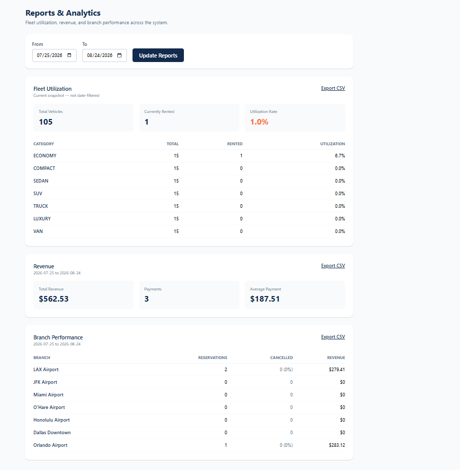

# High Priority Car Rental Management System (HPCRMS)

**Course Project — Software Engineering**
Orion Blackstock (618684)

A full-stack car rental management system covering the entire rental lifecycle — registration, search and reservation, identity verification, digital check-in, payment, pickup, return, fleet and maintenance management, staff administration, and reporting. Built with a Spring Boot REST API backend and a React/TypeScript frontend, deployed live across three cloud platforms.

**Neon hosting:** postgresql://ep-gentle-mountain-ayicfcdd-pooler.c-5.us-east-2.aws.neon.tech/hpcrmsdb?sslmode=require&channel_binding=require
**Backend hosting:** https://swefinalprojecthpcrms-production.up.railway.app/swagger-ui/index.html
**Frontend hosting:** https://swe-final-project-hpcrms.vercel.app/
**Repository:** https://github.com/StockDev136/SWE_Final_Project_HPCRMS

---

## Table of Contents

1. [Project Overview](#1-project-overview)
2. [Vision Document](#2-vision-document)
3. [System Requirements Specification](#3-system-requirements-specification)
4. [System Architecture](#4-system-architecture)
5. [Sequence, Collaboration, and VOPC Diagrams](#5-sequence-collaboration-and-vopc-diagrams)
6. [Technology Stack](#6-technology-stack)
7. [Application-Layer Structure](#7-application-layer-structure)
8. [Installation and Setup](#8-installation-and-setup)
9. [Database Setup](#9-database-setup)
10. [Running the Application](#10-running-the-application)
11. [Automated Tests](#11-automated-tests)
12. [Screenshots](#12-screenshots)
13. [Deployment](#13-deployment)
14. [Known Limitations and Future Improvements](#14-known-limitations-and-future-improvements)

---

## 1. Project Overview

### Problem

Traditional car rental companies rely on manual processes for customer registration, identity verification, vehicle allocation, contract preparation, and payment processing. During peak periods this produces long counter queues, delayed pickups, frustrated customers, and inefficient use of staff time — even when a reservation was already made online, customers are still often required to complete paperwork in person.

### Purpose

HPCRMS digitizes and automates the vehicle rental process end to end, so a customer can reserve, verify their identity, complete documentation, and receive vehicle access with minimal waiting — while giving staff the tools to manage fleet, maintenance, accounts, and reporting from the same platform.

### Scope

The system covers:

- Customer registration, authentication, and profile/rental history
- Vehicle search and reservation (create, modify, cancel) across multiple branches
- Identity verification and digital check-in with an electronic rental agreement
- Online payment processing
- Vehicle pickup and return, including inspection recording
- Staff-side fleet inventory, branch, and employee management
- Vehicle maintenance scheduling
- Reporting and analytics (utilization, revenue, branch performance)

### Stakeholders

| Stakeholder           | Role                                               |
| --------------------- | -------------------------------------------------- |
| Customers             | Reserve, rent, and return vehicles                 |
| Rental Agents         | Assist customers, process walk-in rentals          |
| Branch Managers       | Monitor branch operations, view reports            |
| Fleet Managers        | Manage vehicle inventory and maintenance           |
| Finance Department    | Process payments, refunds, and financial reporting |
| System Administrators | Manage staff accounts and system-wide access       |

### Key Features

- Full customer self-service rental lifecycle (search → reserve → verify → check-in → pay → pick up → return)
- Role-based staff dashboard (Rental Agent, Branch Manager, Fleet Manager, Finance Department, System Administrator)
- Agent-assisted booking for walk-in customers
- Fleet and branch management
- Vehicle maintenance scheduling with status tracking
- Reports and analytics with CSV export
- JWT authentication with server-enforced role-based access control

### Assumptions and Constraints

Carried forward from the Vision Document and SRS:

- Internet connectivity is available at all rental branches
- Customers possess valid driver's licenses
- Online payment gateway and notification services remain available
- Branches share a centralized, real-time-synchronized database
- All customer and payment data must be encrypted in transit (HTTPS/TLS)
- RESTful API architecture; role-based access control enforced system-wide

---

## 2. Vision Document

Full document: [`documents/Orion Blackstock Vision Document.pdf`](<documents/Orion Blackstock Vision Document.pdf>)

**Vision statement:** transform traditional vehicle rental operations into a seamless digital experience by minimizing customer wait times, automating rental processes, and providing fast, secure, and convenient access to vehicles — improving operational efficiency, fleet utilization, and customer experience across all rental locations.

The Vision Document covers the problem statement, product positioning, stakeholder summary, user environment, product perspective, the full needs-and-features list (customer management, digital check-in, rental and vehicle management, reporting and analytics, security), a comparison against manual processes and existing competitors (e.g., TRAWEX), and the original non-functional requirements that the SRS later formalizes.

---

## 3. System Requirements Specification

Full document: [`documents/Orion Blackstock System Requirements Specification Document.pdf`](<documents/Orion Blackstock System Requirements Specification Document.pdf>)

### 3.1 Use Cases

| ID    | Use Case                                | Primary Actor                 | Status   |
| ----- | --------------------------------------- | ----------------------------- | -------- |
| UC-1  | Manage Customer Account                 | Customer                      | ✅ Built |
| UC-2  | Search and Reserve Vehicle              | Customer                      | ✅ Built |
| UC-3  | Verify Customer Identity                | Customer                      | ✅ Built |
| UC-4  | Complete Digital Check-In               | Customer                      | ✅ Built |
| UC-5  | Process Payment                         | Customer                      | ✅ Built |
| UC-6  | Pick Up Vehicle                         | Customer                      | ✅ Built |
| UC-7  | Return Vehicle and Record Inspection    | Rental Agent                  | ✅ Built |
| UC-8  | Manage Vehicle Inventory and Assignment | Fleet Manager                 | ✅ Built |
| UC-9  | Schedule Vehicle Maintenance            | Fleet Manager                 | ✅ Built |
| UC-10 | Generate Reports and Analytics          | Branch/Fleet Manager, Finance | ✅ Built |
| UC-11 | Manage Users and Access                 | System Administrator          | ✅ Built |

Full use-case descriptions (preconditions, basic/alternate flows, postconditions, business rules) for all eleven use cases are in the SRS, Section 4. Use-case, sequence, collaboration, and VOPC diagrams for the three most detailed flows (Reservation, Check-In, Payment) are in Section 5 below.

### 3.2 Functional Requirements (highlights)

- Customers can register, log in, and view rental history without re-entering information on repeat visits
- Vehicle search returns real-time availability filtered by branch, category, and date range
- A reservation cannot be created or modified if it overlaps another reservation on the same vehicle, or another reservation the same customer already holds
- Identity verification checks license format, minimum rental age (21), and license expiration
- The digital rental agreement must be reviewed and signed (typed full legal name) before check-in completes
- Payment must complete before a reservation becomes eligible for pickup
- Vehicle return supports early-return proration when the vehicle had an issue
- Staff accounts are role-scoped; role checks are enforced server-side, not just hidden in the UI

### 3.3 Non-Functional Requirements

| Category    | Requirement                                                                                                                             |
| ----------- | --------------------------------------------------------------------------------------------------------------------------------------- |
| Performance | Vehicle search results within 2 seconds; reservation confirmation within 5 seconds; support ≥1,000 concurrent users; 99.9% availability |
| Usability   | Mobile-responsive; minimal training required for self-service workflows                                                                 |
| Security    | Encrypted data in transit (HTTPS); role-based access control; hashed credentials                                                        |
| Platform    | Web application; RESTful API architecture; cloud-hosted database                                                                        |

## 4. System Architecture

Full document: [`documents/Orion Blackstock System Solution Architecture Document.pdf`](<documents/Orion Blackstock System Solution Architecture Document.pdf>)


### Physical Tiers

| Tier             | Description                                                                                                               |
| ---------------- | ------------------------------------------------------------------------------------------------------------------------- |
| Client Tier      | Browser running the React single-page application                                                                         |
| Application Tier | Spring Boot backend, stateless, deployed on Railway                                                                       |
| Data Tier        | Managed PostgreSQL (Neon) plus external services (payment, license verification, notifications — simulated in this build) |

### Logical Layers

| Layer                    | Responsibility                                                                                  | Technology                                           |
| ------------------------ | ----------------------------------------------------------------------------------------------- | ---------------------------------------------------- |
| Presentation             | Renders the UI, manages client state/routing, calls the REST API, holds the JWT for the session | React, TypeScript, React Router, Axios, Tailwind CSS |
| Controller               | Exposes REST endpoints, validates/maps DTOs, translates HTTP concerns                           | Spring MVC (`@RestController`)                       |
| Service                  | Implements business rules, orchestrates use cases, defines transaction boundaries               | Spring (`@Service`, `@Transactional`)                |
| Repository / DAO         | Abstracts data access and query logic                                                           | Spring Data JPA                                      |
| ORM                      | Maps Java domain objects to relational tables                                                   | Hibernate                                            |
| Security (cross-cutting) | Authenticates requests, enforces RBAC, issues/validates JWTs                                    | Spring Security, JWT                                 |
| Data Store               | Persists all core application data                                                              | PostgreSQL                                           |

### Key Interactions

- The browser loads the React SPA once; thereafter it talks to the backend exclusively through asynchronous REST calls returning JSON
- Every request passes through Spring Security at the Controller layer, which validates the JWT and role before the request reaches the Service layer
- The Service layer is the only layer permitted to call external integrations and the only layer that starts/commits transactions
- The Repository layer is the only layer that queries the database, keeping data-access logic out of the Controller and Presentation layers

---

## 5. Sequence, Collaboration, and VOPC Diagrams

Diagrams are provided for the three most detailed use cases — **Reservation**, **Check-In**, and **Payment** in [`documents/`](documents)

### Reservation

| Sequence                                                                | Collaboration                                                           | VOPC                                                    |
| ----------------------------------------------------------------------- | ----------------------------------------------------------------------- | ------------------------------------------------------- |
|  |  |  |

### Check-In

| Sequence                                                | Collaboration                                                     | VOPC                                            |
| ------------------------------------------------------- | ----------------------------------------------------------------- | ----------------------------------------------- |
|  |  |  |

### Payment

| Sequence                                              | Collaboration                                                   | VOPC                                          |
| ----------------------------------------------------- | --------------------------------------------------------------- | --------------------------------------------- |
|  |  |  |

Use-case diagrams for the Customer and Employee.


---

## 6. Technology Stack

### Backend

| Component         | Technology                     |
| ----------------- | ------------------------------ |
| Language          | Java 25                        |
| Framework         | Spring Boot 4.0.7              |
| Security          | Spring Security, JWT (jjwt)    |
| Data Access       | Spring Data JPA, Hibernate     |
| Object Mapping    | MapStruct 1.6.3                |
| Database          | PostgreSQL 18                  |
| API Documentation | springdoc-openapi (Swagger UI) |
| Build Tool        | Maven                          |
| Testing           | JUnit 5, Mockito               |

### Frontend

| Component   | Technology     |
| ----------- | -------------- |
| Framework   | React 19       |
| Language    | TypeScript     |
| Routing     | React Router 7 |
| Styling     | Tailwind CSS 4 |
| HTTP Client | Axios          |
| Build Tool  | Vite           |

### Deployment

| Layer    | Platform                     |
| -------- | ---------------------------- |
| Frontend | Vercel                       |
| Backend  | Railway (Docker)             |
| Database | Neon (serverless PostgreSQL) |

---

## 7. Application-Layer Structure

The backend follows the layered architecture described in Section 4, under `backend/src/main/java/com/hpcrms/backend/`:

| Package                        | Contents                                                                                                                                                     | Count |
| ------------------------------ | ------------------------------------------------------------------------------------------------------------------------------------------------------------ | ----- |
| `controller`                   | REST endpoints (Auth, Customer, Vehicle, Reservation, CheckIn, Payment, Pickup, Return, Branch, Employee, Maintenance, Report)                               | 12    |
| `service` / `service.impl`     | Business logic and transaction boundaries                                                                                                                    | 11    |
| `repository`                   | Spring Data JPA interfaces                                                                                                                                   | 9     |
| `entity`                       | JPA entities: `Customer`, `Vehicle`, `Branch`, `Reservation`, `RentalAgreement`, `Payment`, `VehicleInspection`, `MaintenanceRecord`, `Employee` (+ 8 enums) | 9     |
| `dto.request` / `dto.response` | Request/response DTOs, kept separate from entities                                                                                                           | 30    |
| `mapper`                       | MapStruct entity ↔ DTO mappers                                                                                                                               | 8     |
| `security`                     | JWT filter, `UserPrincipal`, `CustomUserDetailsService`, `SecurityConfig`                                                                                    | 5     |
| `exception`                    | `GlobalExceptionHandler` and custom exceptions                                                                                                               | 4     |
| `config`                       | CORS, Swagger, and seed/admin-bootstrap configuration                                                                                                        | 2     |

The frontend (`frontend/src/`) is organized by concern: `pages/` (16 route-level pages), `components/` (route guards and shared layout), `api/` (one module per backend resource, thin Axios wrappers), `context/` (auth state), `types/`, and `utils/`.

---

## 8. Installation and Setup

### Prerequisites

- Java 25 (JDK)
- Node.js 18+
- Docker (for local PostgreSQL) — or a PostgreSQL 18 instance you provision yourself
- Maven (or use the included `./mvnw` wrapper — no separate install needed)

### Clone

```bash
git clone https://github.com/StockDev136/SWE_Final_Project_HPCRMS.git
cd SWE_Final_Project_HPCRMS
```

### Backend Configuration

Create `backend/src/main/resources/application-local.properties` (this file is gitignored — never commit it):

```properties
spring.datasource.url=jdbc:postgresql://localhost:5432/HPCRMSDB
spring.datasource.username=hpcrms_user
spring.datasource.password=hpcrms_pass
spring.jpa.hibernate.ddl-auto=update
spring.jpa.defer-datasource-initialization=true
spring.sql.init.mode=always

# Generate a real value with: openssl rand -base64 64
app.jwt.secret=<your-own-generated-secret>
app.jwt.expiration-ms=3600000

# Password for the auto-seeded first admin account
app.admin.default-password=<choose-your-own-password>

server.port=8080
```

Run the backend with this profile active:

```bash
cd backend
./mvnw spring-boot:run -Dspring-boot.run.profiles=local
```

### Frontend Configuration

```bash
cd frontend
cp .env.example .env   # already points at http://localhost:8080/api/v1 by default
npm install
npm run dev
```

The frontend runs at `http://localhost:5173` by default and expects the backend at `http://localhost:8080`.

---

## 9. Database Setup

A `docker-compose.yml` is provided at `backend/docker-compose.yml` for local PostgreSQL:

```bash
cd backend
docker compose up -d
```

This starts PostgreSQL 18 on `localhost:5432` with database `HPCRMSDB`, user `hpcrms_user`, matching the example configuration above.

On first startup, the backend automatically:

- Creates the schema from the JPA entities (`ddl-auto=update`)
- Seeds 7 US branches and 105 vehicles across all 7 categories (`data.sql`, idempotent via `ON CONFLICT DO NOTHING`)
- Seeds one initial `SYSTEM_ADMINISTRATOR` account using the email `admin@hpcrms.com` and the password set in `app.admin.default-password`

To reset to a clean seeded state at any point:

```bash
docker compose down -v
docker compose up -d
```

---

## 10. Running the Application

With the database running and both `application-local.properties` and `frontend/.env` configured:

1. Start the backend: `cd backend && ./mvnw spring-boot:run -Dspring-boot.run.profiles=local`
2. Start the frontend: `cd frontend && npm run dev`
3. Open `http://localhost:5173`
4. Log in as the seeded admin (`admin@hpcrms.com` / the password you set) to access staff features, or register a new customer account to try the self-service flow

API documentation (Swagger UI) is available at `http://localhost:8080/swagger-ui.html` while the backend is running.

---

## 11. Automated Tests

35 JUnit 5 / Mockito tests across three service test classes, each covering normal, boundary, and error cases — not just the happy path.

| Test Class                   | Covers                                                                                        | Tests | Result                  |
| ---------------------------- | --------------------------------------------------------------------------------------------- | ----- | ----------------------- |
| `ReservationServiceImplTest` | Vehicle/customer scheduling conflicts, same-day rentals, cancellation, agent-assisted booking | 14    | ✅ 0 failures, 0 errors |
| `CheckInServiceImplTest`     | Identity verification (age, license expiry), digital check-in, pickup-code generation         | 11    | ✅ 0 failures, 0 errors |
| `PaymentServiceImplTest`     | Payment processing, refunds, ownership checks                                                 | 9     | ✅ 0 failures, 0 errors |
| `BackendApplicationTests`    | Spring context loads                                                                          | 1     | ✅ 0 failures, 0 errors |

**Evidence:** actual Surefire output from a local run (`backend/target/surefire-reports/`):

```
Test set: com.hpcrms.backend.service.impl.ReservationServiceImplTest
Tests run: 14, Failures: 0, Errors: 0, Skipped: 0

Test set: com.hpcrms.backend.service.impl.CheckInServiceImplTest
Tests run: 11, Failures: 0, Errors: 0, Skipped: 0

Test set: com.hpcrms.backend.service.impl.PaymentServiceImplTest
Tests run: 9, Failures: 0, Errors: 0, Skipped: 0

Test set: com.hpcrms.backend.BackendApplicationTests
Tests run: 1, Failures: 0, Errors: 0, Skipped: 0
```

To run the tests yourself:

```bash
cd backend
./mvnw test
```

---

## 12. Screenshots


  
  


---

## 13. Deployment

The application is deployed live across three platforms:

- **Frontend** — Vercel, built from `frontend/`, configured via `VITE_API_BASE_URL`
- **Backend** — Railway, built from the provided `Dockerfile` (multi-stage: `eclipse-temurin:25-jdk` build stage, `eclipse-temurin:25-jre` runtime), configured via `application-prod.properties` and environment variables (`DATABASE_URL`, `JWT_SECRET`, `ADMIN_DEFAULT_PASSWORD`, `ALLOWED_ORIGINS`)
- **Database** — Neon (serverless PostgreSQL)

All secrets (database credentials, JWT secret, admin bootstrap password) are supplied through each platform's environment variable settings — never committed to source control.

---

## 14. Known Limitations and Possible Future Improvements

Stated plainly, not glossed over — these are the gaps between the original SRS and what's actually built:

- **No demand forecasting** (part of UC-10 in the SRS). Utilization, revenue, and branch performance reporting are built and driven by real data; demand forecasting would require genuine predictive modeling, which was out of scope for this build rather than faked with a misleading placeholder.
- **Pickup is code-based, not QR-code scanning** (UC-6 in the SRS specifies a scannable QR code). The system generates and verifies a secure alphanumeric pickup code instead — same purpose (verifying the right person collects the vehicle), different, simpler mechanism.
- **Vehicle assignment is manual, not automatic** (UC-8 in the SRS describes the system automatically assigning the best available vehicle). The customer or agent instead searches and selects a specific vehicle directly.
- **No damage-photo capture on return** (UC-7). Condition notes, mileage, and fuel level are recorded; photo upload is not implemented.
- **The maintenance mid-rental escalation sub-flow is not built** (UC-9). Scheduling, starting, and completing maintenance work; a mid-rental "flag for Branch Manager review" workflow is a separate notification/review feature not included here.
- **External integrations are simulated**: the payment gateway, driver's license verification service, and notification (email/SMS) service are all modeled as external systems in the architecture and SRS, but none has a real third-party integration behind it in this build — payments always succeed after client-side validation, license checks are format/rule-based only, and no real emails or SMS are sent.
- **No reservation-modification UI on the staff side.** The backend service supports staff modifying a customer's reservation on their behalf; the frontend currently only exposes this to the customer themselves.
- **Performance targets are architectural, not verified.** The 1,000-concurrent-user and 99.9%-availability targets from the SRS/Vision Document guided the design (stateless backend, JWT auth) but have not been load-tested.

**Future improvements**, in rough priority order: a real payment gateway integration, real email/SMS notifications, damage-photo upload on return, staff-side reservation modification, and the maintenance mid-rental review workflow.
